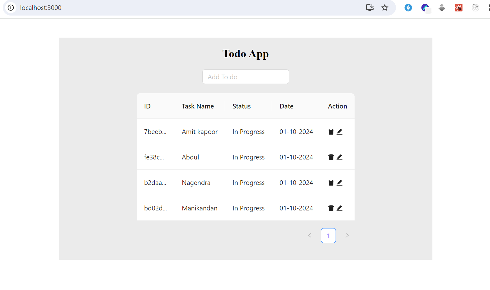
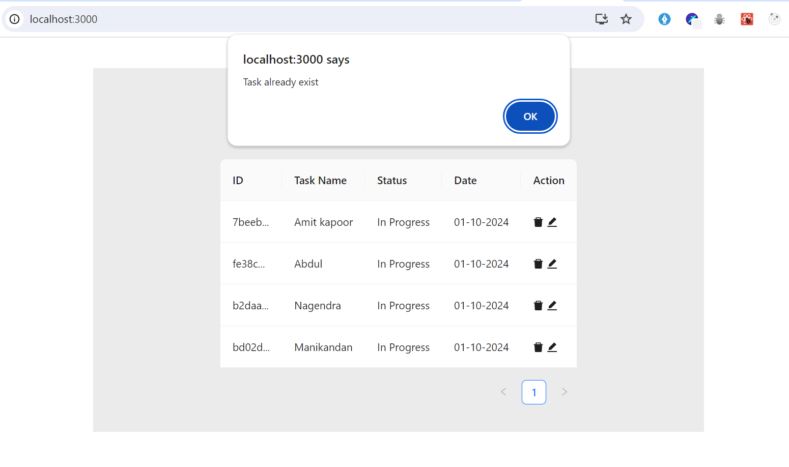

# Todo App 
  Todo App created using Create React App and following packages.
### Created using packages
| UI Library  | State Management |Date Management|
|:------------:|:---------------:|:------------:|
| AntDesign      |   Context API    |        Day JS |

## Features
- Task Creation
- Task Edition
- Task Deletion
- Alert message when adding existing task
- storing in the local storage

## Reference App Image

## Image with Alert message

## To run the Application
- clone the git respository
- npm i - to install required packages
- npm start - to start the server

## Live Demo Link

        <https://todoapp.manilee.site>

